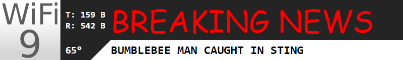

# Bottom Third Overlay for OBS
### Node.js + Express.js + Socket.io (Websockets)

Just a toy script to add a bottom third to OBS. It connect to a router via SSH and gets the "bandwidth" and the CPU temperature (celsius). It will also cycle through and array of "headlines".

Optional Environment Variables (can be set in config):
* BINDIP - Which IP to bind the server to.
* PORT - Which port to listen to.
* ROUTER_HOST - Router IP / FQDN.
* ROUTER_USER - The router SSH username.
* ROUTER_PASS - The router SSH password. (Yeah, not using keys in this example.)
